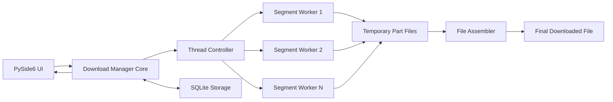

# Simple Download Manager

Simple Download Manager (SDM) is a Python desktop application inspired by IDM and XDM. It demonstrates HTTP Range requests, multithreaded segmented downloads, pause/resume behavior, retries, progress monitoring, and persistent download history.

## Features

- Add downloads from HTTP/HTTPS URLs.
- Split Range-capable files into multiple byte segments.
- Download segments concurrently with worker threads.
- Pause, resume, cancel, and retry downloads.
- Queue downloads when the configured active-download limit is full.
- Resume interrupted downloads after an application restart.
- Fall back to a single worker when a server does not support `Accept-Ranges: bytes`.
- Track progress percentage, speed, ETA, status, and final save path.
- Persist jobs and segments in SQLite for history and resume metadata.
- Use a polished PySide6 desktop UI with queue and history tabs.

## Tech Stack

- **Python 3.10+**
- **PySide6 / Qt** for the desktop interface
- **requests** for HTTP
- **threading + ThreadPoolExecutor** for concurrency
- **SQLite** for persistence
- **pytest** for local integration tests

## Architecture



### Components

- **UI Layer:** `sdm.ui.main_window` renders the dashboard, queue, history, controls, and live progress.
- **Download Manager Core:** `sdm.downloader.DownloadManager` owns jobs, worker threads, retries, pause/resume, cancel, and progress events.
- **Segment Workers:** each worker sends an HTTP `Range` request for one byte interval and writes to a `.part` file.
- **File Assembler:** merges completed `.part` files into the final file after every segment succeeds.
- **Persistence Module:** `sdm.storage.Storage` stores jobs and segments in SQLite.

Communication uses in-process method calls, Qt signals for UI updates, SQLite for durable state, and HTTP/HTTPS for network downloads.

## Setup

```bash
python3 -m venv .venv
source .venv/bin/activate
python -m pip install -e ".[dev]"
```

## Run

```bash
python -m sdm.app
```

Downloads are saved to `downloads/` by default. The app creates `sdm.sqlite3` for history and `downloads/.sdm_temp/` for incomplete segment files. If the app is closed during a download, the next launch marks the interrupted job as paused so it can be resumed safely.

## Test

```bash
python -m pytest
```

The tests start a local HTTP server that supports Range requests, so they do not need internet access.

## Performance Comparison

```bash
PYTHONPATH=src python3 scripts/performance_compare.py
```

The script starts a local throttled Range server and compares one segment against four segments. On this development machine, an 8 MB file completed in 2.03s with one segment and 0.54s with four segments, a 3.76x speedup.

## Thread Model

1. The app creates one `DownloadJob`.
2. The core reads server metadata with `HEAD`.
3. If the server supports byte ranges, the file is divided into N segments.
4. A coordinator thread starts a `ThreadPoolExecutor`.
5. Each segment worker downloads one byte range into a temporary part file.
6. Workers report progress to the core, which updates SQLite and emits UI events.
7. When all segments finish, the assembler writes the final file.

Pause and cancel are cooperative: the manager sets a stop event, workers stop after the current chunk, and partial files remain available for resume unless the job is canceled. Queueing is handled by the manager with a configurable active-download limit; extra jobs stay in `queued` until a slot opens.

## Project Deliverables

- Source code in this repository.
- Architecture documentation in this README.
- Technical report in `docs/technical_report.docx`.
- Demo video checklist in `docs/demo_script.md`.
